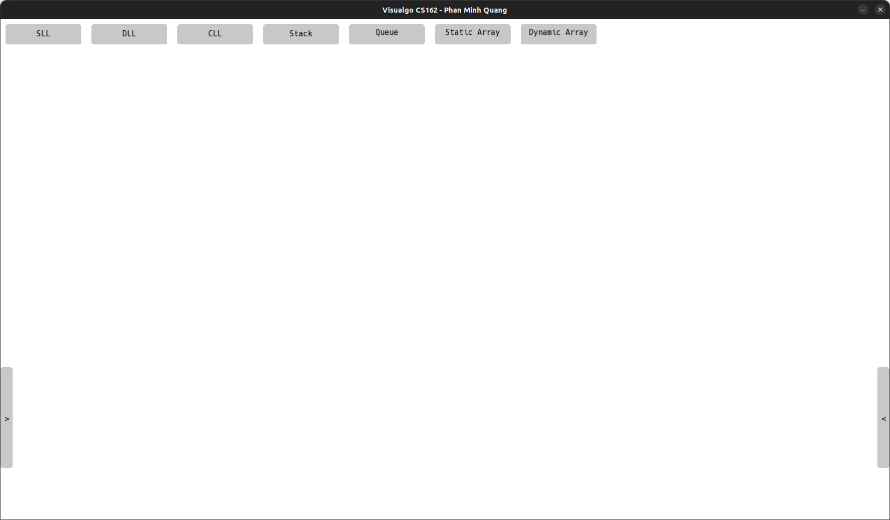
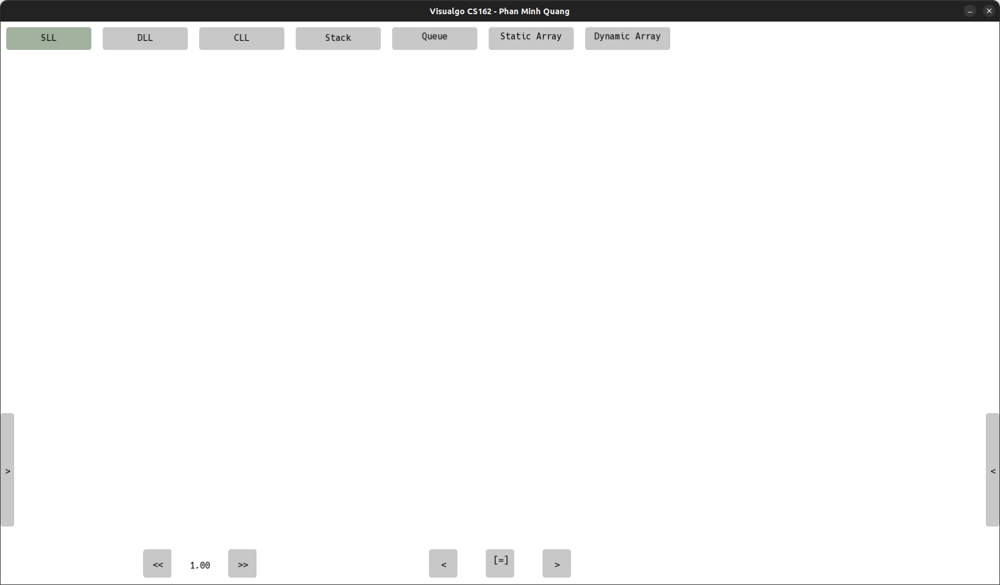
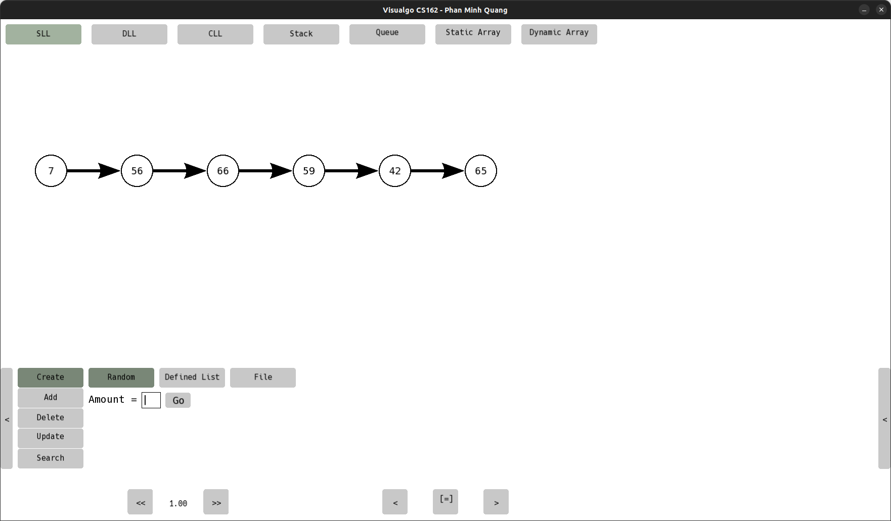
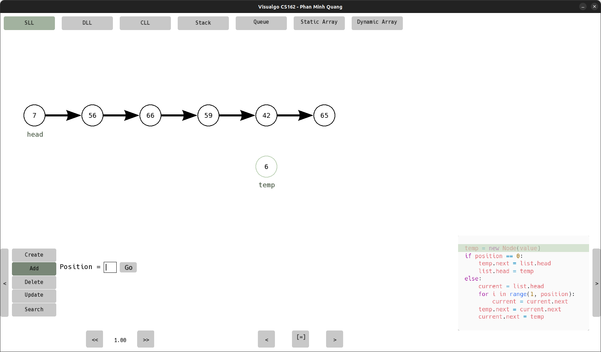
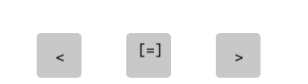
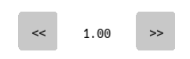

# Visualgo_CS162

This program will visualize some basic data structures, including animations (similar to [Visualgo.net](https://visualgo.net/en/list)). The data structures are:
- Linked List
  - Singly Linked List
  - Doubly Linked List
  - Circular Linked List
- Stack
- Queue
- Array
  - Static Array
  - Dynamic Array

The program is written in C++ and uses SFML library for graphics. 
The features of this project are followed from [this requirements](./docs/CS162-CSC10002-Solo%20Project.pdf).

## How to run

### Pre-requisites

- C++ 17 – GNU GCC 7.3.0+
  - For Windows users, please follow [this instructions](https://www.msys2.org/#installation) to install.
  - For Debian users, run the following command:
    - `sudo apt-get update && sudo apt-get install build-essential`
  - For Mac users, run the following command:
    - `xcode-select --install`
- [CMake 3.26+](https://cmake.org/download/)
- Makefile
  - For Windows users, open the `MSYS2 MinGW 64-bit` terminal and run the following command:
    - `pacman -S make`
  - For Debian users, run the following command:
    - `sudo apt-get install make`
  - For Mac users, `make` is already installed when you run the above command.
- SFML 2.5+
  - For Windows users, please download [this version](https://www.sfml-dev.org/download/sfml/2.5.1/#:~:text=GCC%207.3.0%20MinGW%20(SEH)%20%2D%2064%2Dbit).
  - For Debian users, run the following command:
    - `sudo apt-get install libsfml-dev`
  - For Mac users, please follow [this instructions](https://www.sfml-dev.org/tutorials/2.5/start-osx.php#installing-sfml) to install.
- [Doxygen](https://www.doxygen.nl/download.html) (optional) – for generating documentation

### Build

- Clone this repository
- Run the following commands:
  - `cd Visualgo_CS162`
  - Build the project:
    - for Windows users:
      - `cmake -DSFML_DIR:PATH=<path_to_SFML>/lib/cmake/SFML -G"MinGW Makefiles" -S . -B build`
    - for Debian and Mac users:
      - `cmake -S . -B build`
  - `make -C build`
- The executable file will be in the `build` folder

### Run

- Click on the executable file in the folder `build` to run the program.
- If you want to run the program in the terminal, run the following command:
  - `cd build && ./Visualgo_CS162`

## How to use

- The program will show the main screen when it starts.

- Select a data structure by clicking on the buttons on the top-left of the screen.
- Do the operations on the data structure by clicking on the arrow button on the left side of the screen.
- Read the demo code by clicking on the arrow button on the right side of the screen.

- Example for using the creating mode:

- If you choose the other modes, it will show the animation of the operations on the data structure and demonstrate the demo code at the same time.

- Run the animation by clicking on the play/pause button in the controller.
- Next step by clicking on the next button in the controller.
- Previous step by clicking on the previous button in the controller.

- You can change the speed of the animation by clicking on the speed button in the controller.

- In other data structures, it will as same as the above instructions.

## Program structure

- `assets` – contains the assets used in the program
- `build` – contains the executable file
- `docs` – contains the documentation of the program
  - `html` – contains the html files of the documentation
  - `latex` – contains the latex files of the documentation
- `include` – contains the header and source files of the program
  - `core` – contains the core classes of the program
  - `draw` - contains the classes that draw objects structures
  - `libScene` - contains the classes that manage the scenes
  - `stuff` - contains other classes that are used in the program

## Documentation

You can find the documentation [here](https://diriimq.github.io/Visualgo_CS162/html/) and watch the demo [here](https://youtu.be/).

## License

This project is licensed under the `GPL-3.0 License` - see the [LICENSE](./LICENSE) file for details.
